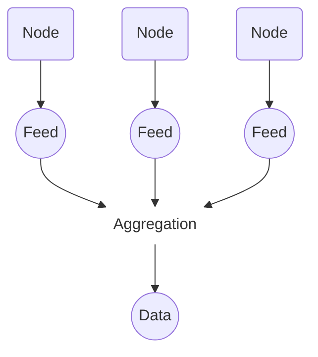
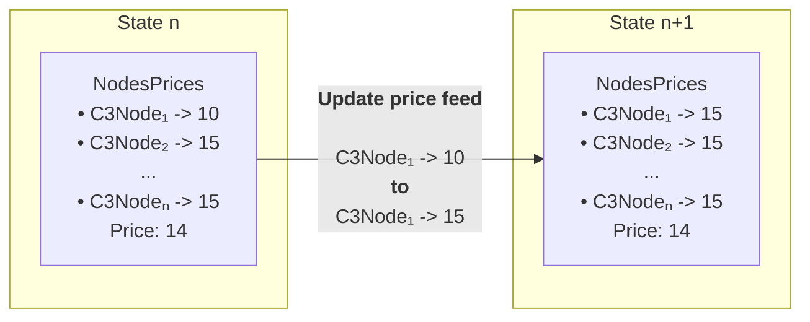
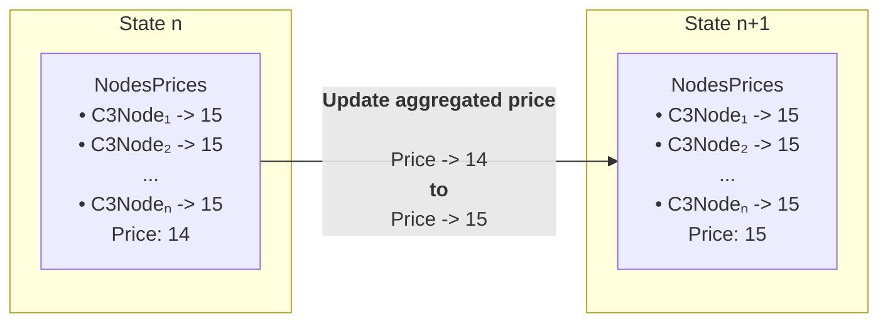

# Charli3 Oracle design

## Protocol design and flow overview

### Problem

Timely and accurate data is essential for decentralized applications, yet Cardano's block generation rate limits the frequency of updates, posing a challenge to Oracle's performance. Charli3 tackles this by employing a Substrate-based sidechain that offloads data ingestion and aggregation. This design enhances data throughput and quality while strategically reducing costs associated with frequent updates. By utilizing Substrate's capabilities, we ensure that data delivery to Cardano remains efficient and reliable, providing an optimized and cost-effective solution for seamless dApp integration.

### Quick Oracle description

The protocol's main entities are the Oracle nodes, which are in charge of filling their data feeds. Then, a node consensus algorithm named _aggregation_ defines the latest trusted data available for being referenced by external clients like dApps.



The aggregation consensus algorithm also helps to detect which nodes provided valuable information, thus allowing for this good behavior to be rewarded. Related to exchange prices, valuable good information would include numbers within an expected price range, as any outrageous number could potentially make a big difference in the aggregated value. The reward system encourages the nodes not to provide any far-fetched information, but the aggregation algorithm should consider this and monitor the nodes' values.

## Substrate

In a general-purpose blockchain, all Oracle operations are placed at the application layer. This means that all the Oracle protocol is implemented with transactions that update some shared state, while the consensus protocol and all low-level aspects of the blockchain are application layer agnostic. In contrast, with an appchain, which is a blockchain built for a specific purpose, we can leverage low-level mechanisms augmented with the Oracle protocol logic to optimize resources while retaining the important aspects of a general-purpose blockchain: security and decentralization, adding real-time data availability and reliability at a lower cost. Moreover, custom-built blockchain characteristics can be removed to avoid unnecessary complexity and make the node's design more specific and optimized for our use case.

With Substrate, we can define nodes that act not only as blockchain nodes but also as Oracle nodes. This means that, in this context, a node can query data from the external world to fill some exchange _price_, and all network nodes take turns producing blocks based on some consensus algorithm. The price from each node and the _aggregated price_ will be stored in the blockchain's global state, which the nodes will modify through _state transitions_. The two notable transitions worth mentioning are:

- A node fills a price in a specific place meant for that node



- Each node computes an aggregated price when the block is finalized



The first state transition involves submitting a transaction that will not pay for fees, allowing the Oracle protocol to optimize the costs of refreshing prices. The second state transition will be performed at the end of each block after the aggregated price is computed, but no transaction is involved in this step. Instead, it is just a state modification part of the last phase of block production.

A customized consensus protocol with the node rewards mechanism built-in can be added and easily updated. We will start with a simple round-robin consensus algorithm, assuring equal block production for each node. However, the final goal is a consensus mechanism that will be closely related to nodes in the Cardano blockchain.

Also, as opposed to a general-purpose blockchain, block production and transactions can be submitted as fast as we need, without restrictions. Thus, we can control the price data refresh rate without incurring unbearable costs because of zero transaction fees. Thus, at any given moment, the latest block will have an up-to-date feed.

The application flow can be summarized as follows: For each block, one node takes its turn to author the block, while the other nodes submit their fetched price. This is done by updating a global state that records which node provided each price. At the end of the block, an aggregated value of all submitted prices is calculated and stored as a separate value.

## Implementation

### Assumptions

For this design, a few assumptions were made for simplicity:

- Fixed quantity of nodes
- One-to-one relationship between nodes and price feeds

### Storage

Storage is one of the key components of a Substrate-based blockchain, as it represents the state of the blockchain. The storage is a modified Merkle tree at the lowest level, but the Substrate SDK provides several high-level abstractions. Two of them were used for this design:

- The `StorageMap<T>` structure was used as it allows storing several key-value pairs. Each pair has three pieces of information: which node sent the price, as the key, and the price itself and the block at which it was submitted, as the value.

```rust
#[pallet::storage]
   pub type NodesPrices<T: Config> = StorageMap<
       Hasher = Identity,
       Key = T::AccountId,
       Value = (u32, BlockNumberFor<T>),
       QueryKind = OptionQuery,
   >;
```

Knowing which node sent what price and when is important for a future implementation of a reward system.

- the `StorageValue<T>` structure was used to store the final aggregated price at the end of each block, and the age of the price.

```rust
#[pallet::storage]
pub type Price<T> = StorageValue<_, (u32, u16)>;
```

Also, we store the Oracle configuration at the Storage.

```rust
#[pallet::storage]
pub type MinNodesForTrustedAggregation<T> = StorageValue<_, u32>;

#[pallet::storage]
pub type FeedAge<T: Config> = StorageValue<_, BlockNumberFor<T>>;

#[pallet::storage]
pub type OutliersRange<T> = StorageValue<_, u32>;

#[pallet::storage]
pub type DivergencePercentage<T> = StorageValue<_, u32>;

```

Initial values for these configuration fields can be defined in the chain specification file, which are then applied in the genesis block.

#### Partner chain account to Cardano address map

This storage map is used to associate accounts from the partner chain to Cardano addresses.

```rust
#[pallet::storage]
pub type OracKeyToMainchainAddress<T: Config> = StorageMap<
    Hasher = Identity,
    Key = T::AccountId,
    Value = MainchainAddress,
    QueryKind = OptionQuery
>;
```

 There is a partner chain account for each node, and the Cardano address related to it in this map can be used to award rewards in the case that the node is elegible for it.

### Aggregation algorithm

The Oracle configuration storage is used in the aggregation process to define the conditions necessary for the aggregation algorithm to be executed normally. That is, we need to have at least `N` nodes with a price at most `M` blocks old, where:

- `N` is the value stored in `MinNodesForTrustedAggregation`,
- `M` is the value stored in `FeedAge`.

When this conditions are met, the aggregation can proceed as expected: the values are ordered and their median is calculated. The third and fourth values of the Oracle configuration, `OutliersRange` and `DivergencePercentage`, can be used to detect which values were closest to the median and thus reward the nodes that provided these prices.

Then, the `aggregation algorithm` will follow these steps:

1. `Get` the prices from the storage
2. `Filter` the prices according to age
3. `Count` the amount of prices:
   a. If there are enough prices, `sort` and `calculate median`
   b. If there aren't enough prices, `use previous median`
4. `Filter` outliers
5. `List` the Cardano addresses that could receive rewards, according to the non-outlier prices

Once the calculation is finished, the median price is stored in `Price`, along with the age set as `0`, and a `Status` event is dispatched.

The `Status` event informs the following details of the aggregation algorithm for the block:

- the `median price` calculated for the block
- the `flag` of the price, this is whether the algorithm was executed normally or if anything uncommon happened. The flags can be:
    - `Ok`
    - `NotEnoughNodes`
    - `NoPreviousMedian`
- the `number of nodes` that participated by submitting a price
- the `age` of the price
- the current `block`
- the `aggregation status`, which is one of the following:
    - `AggregationPerformed` including the details about the outliers, non_outliers, and a list of addresses elegible for rewards 
    - `AggregationNotPerformed` to signal that there isn't a new aggregated price for the block

### Price Providers

The price providers are implemented as functions that are called by offchain workers.
The offchain workers are triggered at the beginning of each block and call these functions to fetch the price from an external source and submit it to the blockchain.

The price provider interface is defined as:

```rust
pub trait PriceProvider {
    fn fetch_price() -> Result<u32, http::Error>;
}
```

Currently, there is one price provider implemented:

- `CryptoCompare`: Fetches the ADA/USD price from the CryptoCompare API. The price is returned with 3 decimal places of precision (multiplied by 1000).

and we'll add more in the future.

The price provider will be configurable through a JSON configuration file that each node reads during startup. This allows nodes to choose their preferred price provider without modifying the codebase.

## Detailed oracle flow

At the beginning of a new block, an off-chain worker is triggered to query for a new feed price and to include it into the blockchain. This inclusion happens through extrinsics, which is the general term used in Substrate for transactions and information that originates outside of the blockchain. As mentioned, there is an extrinsic in this case, which involves inserting the price, and the time at which it is inserted, in the StorageMap using the node's AccountId as the key.

Meanwhile, the block author, who is responsible for producing and finalizing the block, receives the extrinsics submitted by each node. Then, the block is the series of the extrinsics along with the block header which holds other relevant information such as the hash of the current storage state.

When the block is about to be finalized, that is, after there are no more extrinsics to be executed, the storage is updated with the calculated aggregated price. This modification does not use any extrinsics to store the value, thus each node performs the modification only based on the extrinsics inside the current block.

It can be assured that every node stores the same aggregated price because as mentioned the storage is a Merkle Tree, and its hash is included in the block header. This hash can be used to ensure that the state transitioned correctly. If any node wanted to maliciously change the aggregated price, or any value in the storageMap for that matter, the hashes would not match.
